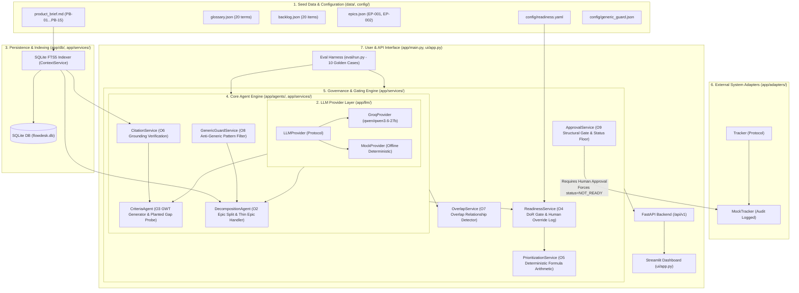
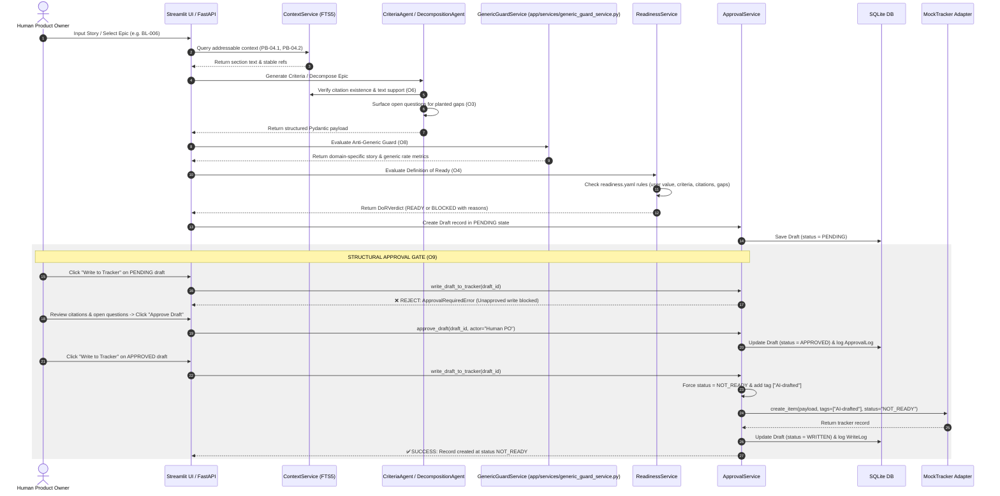

# Architecture Specification — PO Backlog Architect Agent

## System Overview
The PO Backlog Architect Agent is built with clear architectural boundaries separating persistent seed datasets, full-text context indexing, core LLM agents, deterministic governance algorithms, adapter layers, human approval gating, REST endpoints, Streamlit dashboard UI, and evaluation infrastructure.

---

## 📐 End-to-End Architecture Diagram

---

## 🔄 End-to-End Execution Sequence Flow

The diagram below illustrates the exact step-by-step sequence when an Epic or Story is processed from raw intake through human gating to tracker creation:

---

## 🛡️ Key Architectural Principles & Safeguards

### 1. Structural Approval Gate & Status Floor (O9)
- **Service-Layer Gating**: External system writes (creating tracker issues or comments) cannot be triggered directly by LLM model outputs or prompt instructions.
- **State Machine Rules**:
  - `PENDING` draft write attempt -> Raises `ApprovalRequiredError`.
  - `REJECTED` draft write attempt -> Raises `ApprovalRequiredError`.
  - `WRITTEN` draft duplicate write attempt -> Raises `AlreadyWrittenError` (Idempotent safeguard).
- **Status Floor Locking**: When a human approves a draft and triggers a write to `MockTracker`, the service layer forces `status = NOT_READY` and adds tag `AI-drafted`. The LLM has zero permission to set a draft's status to `READY`.

### 2. Claim-Level Citation Verification (O6)
- **Existence Check**: Asserts section refs (`PB-04.1`) exist in `context_sections`. Whole-document citations are rejected as unresolvable.
- **Support Check**: Asserts section content supports the claimed requirement. Unsupported claims are placed in `unsupported_claims[]` and never hidden.

### 3. Deterministic Governance & Prioritization (O5)
- Prioritization scores are computed 100% in Python code via an explicit weighted arithmetic formula:
  $$\text{Base} = 0.40 \cdot \text{BV} + 0.25 \cdot \text{Urgency} + 0.20 \cdot \text{Risk} + 0.15 \cdot \text{Alignment}$$
  $$\text{Final} = \text{Base} \cdot \text{ReadinessFactor} \cdot (1 - 0.10 \cdot \text{DependencyPenalty})$$
- Sprint slices are sorted topologically so no story is proposed ahead of an unmet dependency.

---

## 🔌 Adapter Contracts & Swappability
All external data and provider connections use abstract Python `Protocol` or `ABC` interfaces:

1. **`LLMProvider` Protocol** (`app/llm/base.py`):
   - `GroqProvider` (`qwen/qwen3.6-27b` via REST API)
   - `MockProvider` (Offline deterministic mock for instant test suites)
2. **`Tracker` Protocol** (`app/adapters/tracker.py`):
   - `MockTracker` (Local in-memory / audit-logged tracker)
3. **`DocumentStore` Protocol** (`app/adapters/doc_store.py`):
   - `MockDocumentStore` (Markdown context loader)
