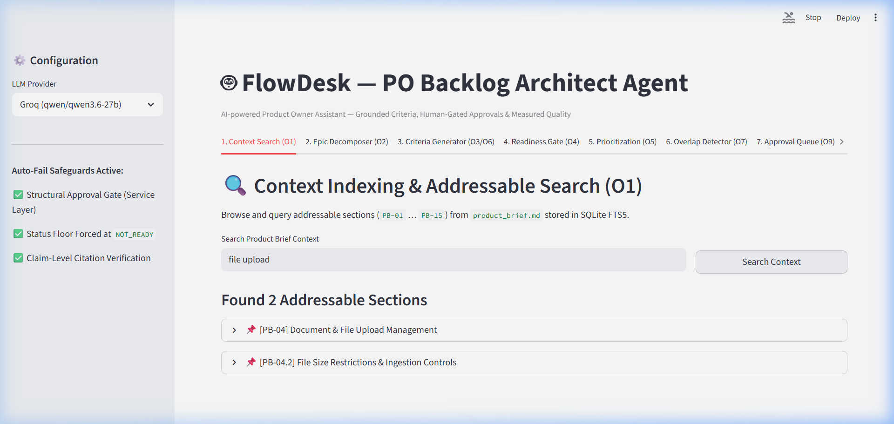
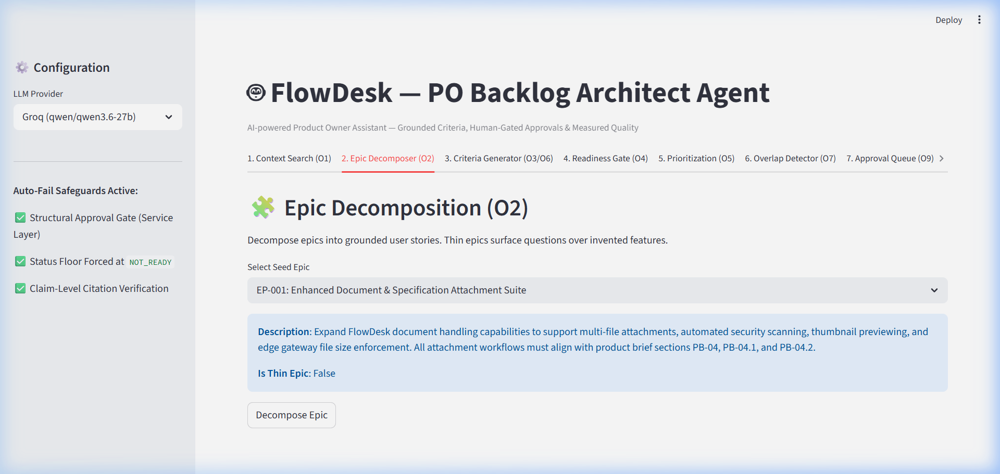
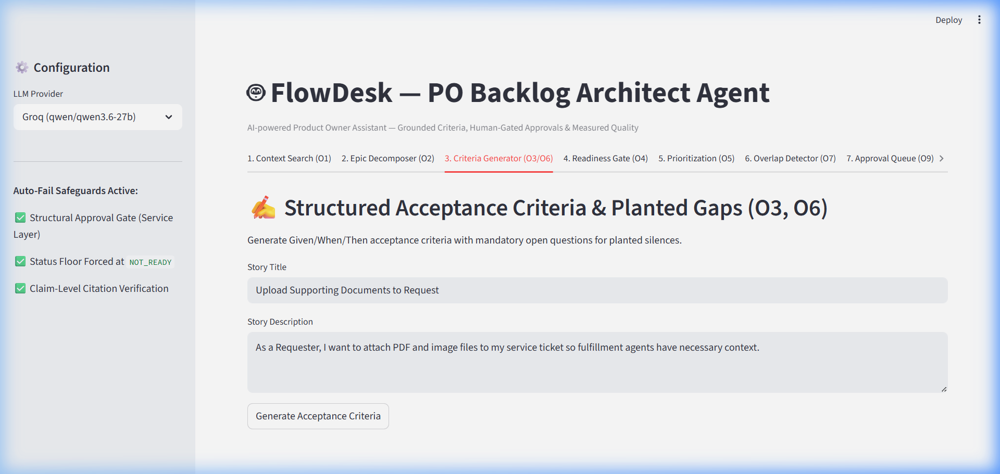
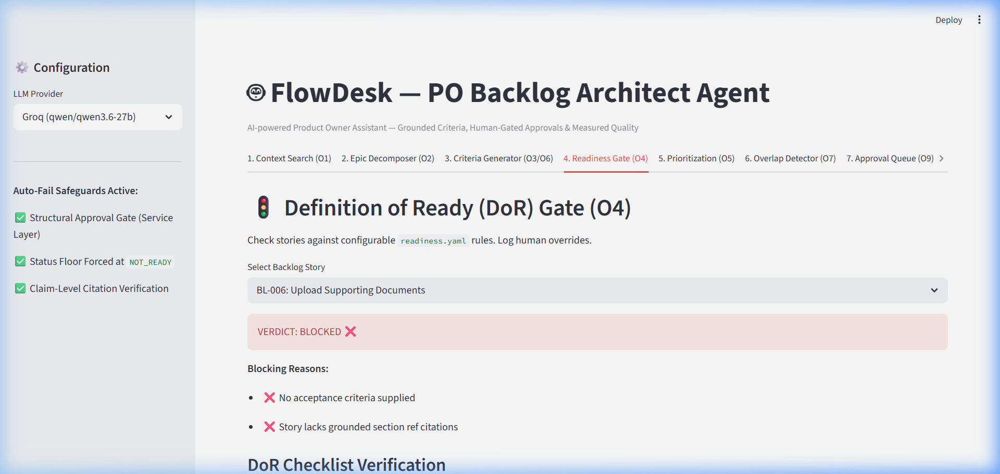
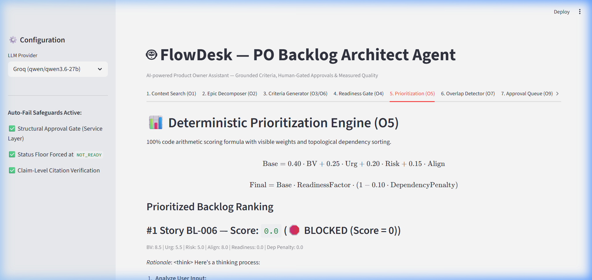
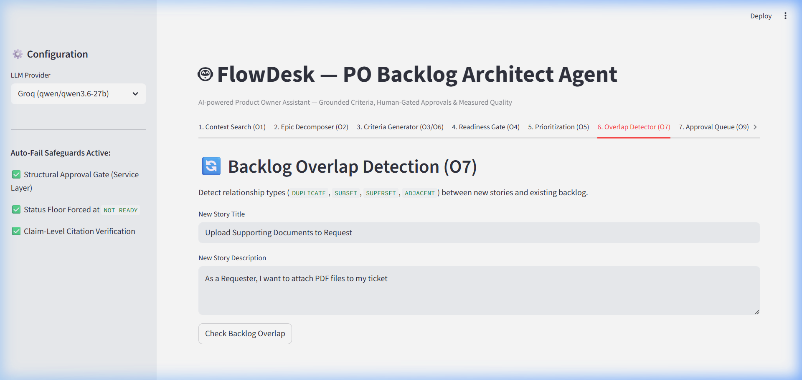
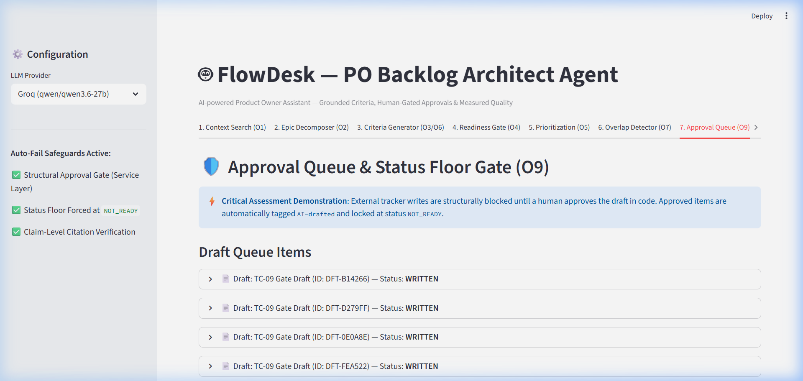

# 📖 FlowDesk PO Backlog Architect Agent — Visual User Guide & Walkthrough

Welcome to the **FlowDesk PO Backlog Architect Agent** dashboard user guide! This document provides a step-by-step visual tour of the entire application across all 7 interactive tabs.

---

## 🎨 Global Application Layout & Sidebar

When you launch the Streamlit dashboard (`http://localhost:8501`), the left sidebar displays key system configuration parameters and active safety controls:

1. **LLM Provider Selector**: Toggle between **Groq (`qwen/qwen3.6-27b`)** for live AI generation and **Mock (`deterministic`)** for fast offline regression testing.
2. **Auto-Fail Safeguards Active**:
   - ✅ **Structural Approval Gate**: Enforced at the FastAPI service layer (`HTTP 403`).
   - ✅ **Status Floor**: Any AI-drafted item is forcibly locked to status `NOT_READY`.
   - ✅ **Claim-Level Citation Verification**: Enforces numeric & textual section-grounding (`PB-01` … `PB-15`).

---

## 🔍 Tab 1: Context Indexing & Addressable Search (O1)

### Purpose
Search the indexed **FlowDesk Product Brief** (`product_brief.md`) using SQLite FTS5 full-text search. Every section is indexed with precise section IDs (`PB-01` … `PB-15`).

### How to Use Step-by-Step:
1. Click on **Tab 1: Context Search (O1)**.
2. Enter a search term into the input box (e.g., `file upload`, `approval`, `requester`).
3. Click **Search Context**.
4. Expand any result card (`[PB-04] Document & File Upload Management`) to view the exact verbatim context text.

### What to Look For in Your Demo:
- Demonstrate section-level precision (`PB-04.1`, `PB-04.2`). Explain that this addressable context is what enables citation validation.

---

## 🧩 Tab 2: Epic Decomposer & Gap Detection (O2)

### Purpose
Decomposes high-level epics into user stories, surfaced open questions, and missing domain concepts.

### How to Use Step-by-Step:
1. Click on **Tab 2: Epic Decomposer (O2)**.
2. Select an epic from the dropdown:
   - **Detailed Epic (`EP-001` Document Management)**: Generates complete user stories with citations.
   - **Thin Epic (`EP-002` Approval Automation)**: Detects insufficient detail and surfaces `questions > stories`.
3. Click **Decompose Epic**.
4. Inspect the output:
   - Generated User Stories (`As a... I want... So that...`)
   - Surfaced Open Questions for planted gaps in the specification.

---

## 📋 Tab 3: Acceptance Criteria & Anti-Generic Guard (O3/O6/O8)

### Purpose
Generates Given/When/Then (GWT) acceptance criteria with claim-level citations and runs the **3-Layer Anti-Generic Guard**.

### How to Use Step-by-Step:
1. Click on **Tab 3: Criteria Generator (O3/O6)**.
2. Select a backlog story or enter custom story details.
3. Click **Generate Criteria**.
4. View the generated GWT scenarios alongside verified citations (`PB-04.1`).
5. **Anti-Generic Guard Check**:
   - Type a generic phrase like `"Manage my data efficiently"`.
   - Click **Evaluate Specificity**.
   - Observe the 3-layer output (Layer 1 phrase match, Layer 2 regex patterns, Layer 3 specificity score `score=1`, `GENERIC`).
   - Observe the auto-rewritten story with domain-specific role and measurable outcome.

---

## 🚦 Tab 4: Definition of Ready (DoR) Gate (O4)

### Purpose
Evaluates stories against 6 configurable Definition of Ready rules specified in `config/readiness.yaml`.

### How to Use Step-by-Step:
1. Click on **Tab 4: Readiness Gate (O4)**.
2. Select a story (e.g., `BL-003` which lacks acceptance criteria, vs `BL-005` which is complete).
3. Click **Evaluate Readiness**.
4. Inspect the evaluation breakdown:
   - `has_acceptance_criteria`: PASS/FAIL
   - `has_citations`: PASS/FAIL
   - `no_unresolved_open_questions`: PASS/FAIL
   - `anti_generic_score`: PASS/FAIL
   - **Final Status**: `READY` or `BLOCKED`.

---

## 📊 Tab 5: Prioritization Engine (O5)

### Purpose
Calculates deterministic priority scores using an explicit formula and performs topological sorting for sprint sequencing.

### How to Use Step-by-Step:
1. Click on **Tab 5: Prioritization (O5)**.
2. Click **Run Prioritization Engine**.
3. View the scored backlog table sorted by computed priority.
4. Expand any item to inspect the mathematical formula breakdown:
   $$\text{Score} = (\text{Business Value} \times 0.3) + (\text{Urgency} \times 0.2) + (\text{Risk Reduction} \times 0.2) + (\text{Strategic Alignment} \times 0.15) - (\text{Dependency Penalty} \times 0.1) + (\text{Readiness Factor} \times 0.05)$$

---

## 🔍 Tab 6: Overlap & Duplicate Detector (O7)

### Purpose
Detects relationships between new request stories and existing backlog items to prevent duplicate engineering effort.

### How to Use Step-by-Step:
1. Click on **Tab 6: Overlap Detector (O7)**.
2. Select a candidate story (e.g., `BL-006` Document Upload).
3. Click **Check Overlap**.
4. View the relationship classification (`DUPLICATE`, `SUBSET`, `SUPERSET`, `ADJACENT`, `NONE`), confidence score, and recommended action.

---

## 🔐 Tab 7: Approval Queue & Write Gate (O9)

### Purpose
Demonstrates the structural human approval gate, status floor enforcement, and external tracker write protection.

### How to Use Step-by-Step:
1. Click on **Tab 7: Approval Queue (O9)**.
2. View pending drafts in the approval queue.
3. Attempt to write an unapproved (`PENDING`) draft directly to MockTracker:
   - Click **Write to Tracker**.
   - Observe the error: **`HTTP 403 Forbidden: Draft DFT-XXX must be APPROVED before writing to tracker`**.
4. Human Approval Action:
   - Click **Approve Draft**. Status transitions to `APPROVED`.
5. Write to External Tracker:
   - Click **Write to Tracker**.
   - Response: **`HTTP 200 OK`**.
   - Observe the written item in MockTracker: Status is forcibly locked to **`NOT_READY`** and tagged **`AI-drafted`**.

---

## Summary of Verified Application State

- **FastAPI REST Server**: `http://localhost:8000/docs` (Active)
- **Streamlit UI Dashboard**: `http://localhost:8501` (Active)
- **Test Suite**: `24/24 PASS (100%)`
- **Evaluation Harness**: `10/10 PASS (Mock)`, `10/10 PASS (Groq)`, `7/7 PASS (Adversarial)`
